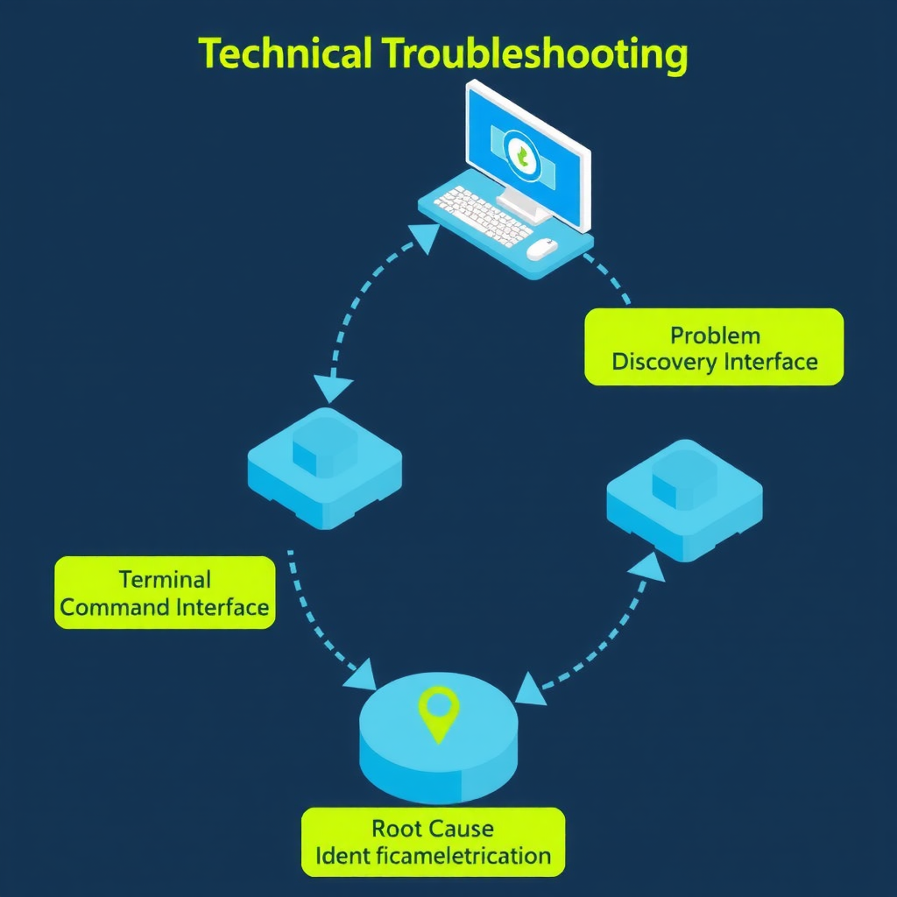
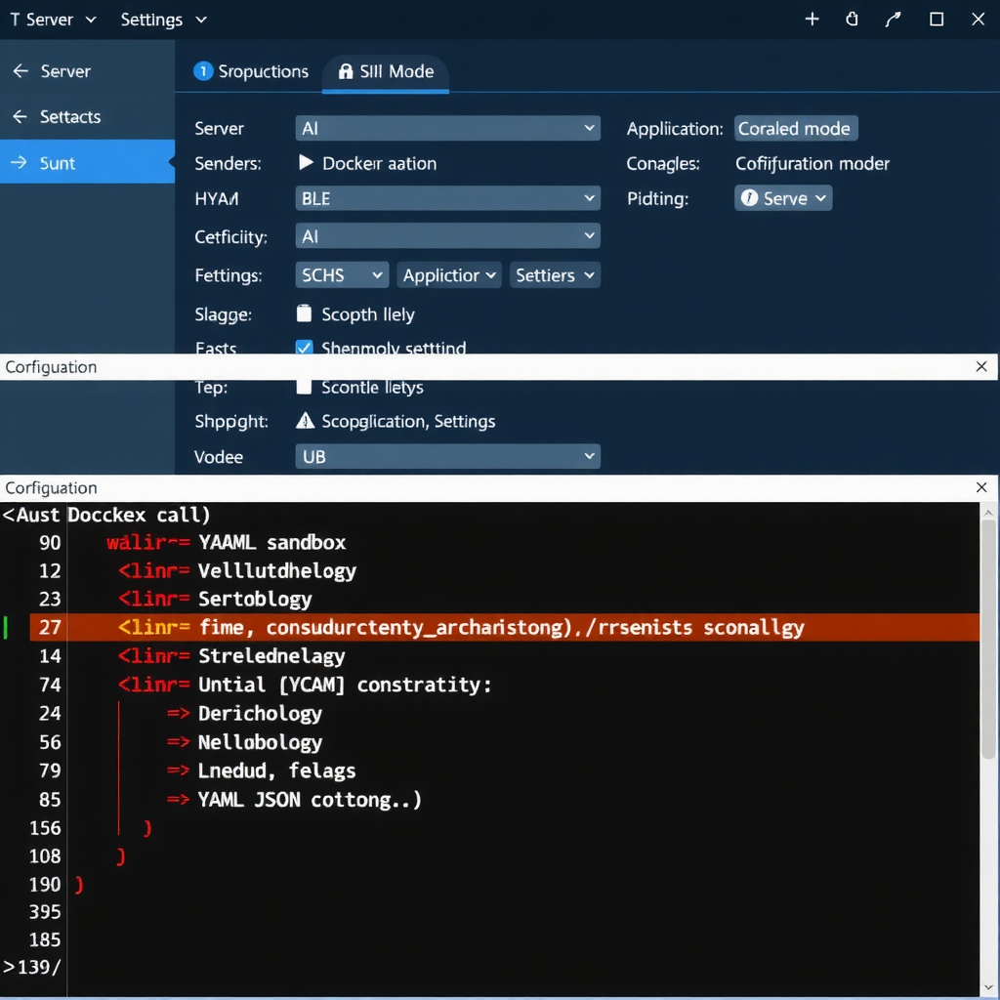

# 当我的 AI 助手突然"失忆"了 —— OpenClaw Sandbox 模式故障排查实录



## 前言

今天是个平常的周六下午，我像往常一样让 AI 助手帮我处理一个任务。好家伙，它竟然报错了：

```
Failed to inspect sandbox image: failed to connect to the docker API
```

什么情况？我的 AI 助手一直运行得好好的，怎么突然就连不上 Docker 了？更奇怪的是，我压根没让它用 Docker 啊！

这篇文章记录了这次故障的完整排查过程，希望能帮到遇到类似问题的朋友。

## 问题发现

### 故障现象

当天下午，我向 AI 助手发送了一个处理任务的请求。正常情况下，它应该：

1. 访问网络资源
2. 提取需要的数据
3. 保存到本地

但这次，它返回了一串错误：

```
⚠️ Agent failed before reply: Failed to inspect sandbox image
```

随后我尝试直接在沙箱内执行命令，发现整个环境都是**只读**的：

```
mount0 on /workspace type virtiofs (ro,relatime)
overlay on / type overlay (ro,relatime)
```

沙箱内没有 curl、wget、python 等基本工具，连 `/workspace` 目录都是只读挂载。

### 第一反应

我首先想到的是：

- 飞书插件昨天刚更新，是不是插件导致的问题？
- Colima/Docker 服务没启动？

但经过排查，飞书插件加载正常，Colima 也在运行中。问题似乎更深层。

## 深入排查

### 检查运行时信息

我让 AI 助手查看自己的运行状态：

```
Runtime: docker/all
```

**关键发现！Runtime 显示为 `docker/all`，而不是之前的 `direct`（host 模式）。**

这说明 AI 助手当前运行在 Docker 容器内，而不是直接在主机上。

### 配置文件对比

检查配置备份文件，发现了关键变化：

| 时间 | 配置文件 | sandbox 配置 |
|------|----------|--------------|
| 3月6日 20:48 | bak.4 | 无 sandbox 字段 |
| 3月6日 21:20 | bak.3 | 无 sandbox 字段 |
| **3月7日 12:24** | bak.2 | `sandbox.mode: "all"` |
| 3月7日 12:43 | 当前配置 | `sandbox.mode: "all"` |

配置在 3 月 7 日 12:24 被修改了！谁干的？

### 追踪真凶

进一步查看配置审计日志：

```
wizard.lastRunAt: "2026-03-07T04:24:58.443Z" (UTC)
                 = 2026-03-07 12:24:58 (北京时间)
wizard.lastRunCommand: "doctor"
```

**真相大白**：`openclaw doctor --fix` 命令在 3 月 7 日 12:24 执行，自动添加了 `sandbox.mode: "all"` 配置。



## Host 模式 vs Docker 模式对比

为了更好地理解问题，我们来对比一下两种运行模式：

### Host 模式（direct）

| 特性 | 说明 |
|------|------|
| **运行方式** | 直接在主机系统上执行命令 |
| **文件访问** | 完全访问主机文件系统 |
| **网络访问** | 直接使用主机网络 |
| **工具可用性** | 使用主机安装的所有工具 |
| **性能** | 无虚拟化开销，性能最优 |
| **安全性** | 较低，命令直接影响主机 |
| **适用场景** | 个人开发、可信环境 |

### Docker 模式（sandbox）

| 特性 | 说明 |
|------|------|
| **运行方式** | 在 Docker 容器内隔离执行 |
| **文件访问** | 仅访问挂载的目录，默认只读 |
| **网络访问** | 容器网络，需要特殊配置 |
| **工具可用性** | 仅使用容器内预装工具 |
| **性能** | 有虚拟化开销，略有延迟 |
| **安全性** | 较高，命令隔离在容器内 |
| **适用场景** | 生产环境、多用户、不信任场景 |

### 可视化对比


```
┌─────────────────────────────────────────────────────────────┐
│                      HOST 模式                               │
├─────────────────────────────────────────────────────────────┤
│  ┌─────────────┐                                            │
│  │ AI Assistant│ ──────直接执行──────▶ 主机系统             │
│  └─────────────┘                      │                     │
│                                       ├── 文件系统 ✅       │
│                                       ├── 网络 ✅           │
│                                       └── 工具 ✅           │
└─────────────────────────────────────────────────────────────┘

┌─────────────────────────────────────────────────────────────┐
│                    DOCKER 模式                               │
├─────────────────────────────────────────────────────────────┤
│  ┌─────────────┐      ┌─────────────┐                       │
│  │ AI Assistant│ ───▶ │  Docker容器 │ ──▶ 主机系统         │
│  └─────────────┘      └─────────────┘      │               │
│                            │               ├── 文件系统 🔒  │
│                            └── 隔离层 ──▶  ├── 网络 🔒      │
│                                            └── 工具 ❌      │
└─────────────────────────────────────────────────────────────┘
```

### 配置选项

OpenClaw 的 `sandbox.mode` 支持三个值：

```bash
# 关闭沙箱 = host 模式（推荐个人使用）
openclaw config set agents.defaults.sandbox.mode off

# 只有子会话用沙箱
openclaw config set agents.defaults.sandbox.mode non-main

# 所有会话都用沙箱
openclaw config set agents.defaults.sandbox.mode all
```

## 问题解决

知道了问题所在，解决方案就很简单了：

```bash
# 切换回 host 模式
openclaw config set agents.defaults.sandbox.mode off

# 重启 Gateway 使配置生效
openclaw gateway restart
```

执行后验证：

```
Runtime: direct ✅
```

AI 助手恢复正常！


## 故障处理经验总结

### 1. 问题诊断方法论

```
发现问题 → 查看错误日志 → 检查运行状态 → 对比配置变化 → 定位根因 → 解决问题
```

**关键步骤**：
- **保留配置备份**：这次能快速定位问题，得益于 OpenClaw 自动保存的配置备份文件
- **查看时间线**：通过文件修改时间，精确定位配置变更的时间点
- **审计日志**：`wizard.lastRunCommand` 记录了触发变更的命令

### 2. 安全配置的"双刃剑"

`openclaw doctor --fix` 是一个很有用的诊断修复命令，但它可能会：

- 自动修改安全配置（如 sandbox 模式）
- 根据当前系统状态做出判断（Docker 可用时启用沙箱）
- 在用户不知情的情况下改变行为

**建议**：
- 执行 `doctor --fix` 后，检查配置变更
- 使用 `openclaw config get` 查看当前配置
- 理解每个配置项的含义

### 3. Docker 依赖检查

如果使用 Docker 模式，需要确保：

```bash
# 检查 Docker 服务
docker ps

# 检查 Colima（macOS）
colima status

# 检查 Docker Socket
ls -la /var/run/docker.sock
```

如果 Docker 不可用却启用了 Docker 模式，会看到各种连接错误。

### 4. 配置文件位置

OpenClaw 的配置文件位于：

```
~/.openclaw/openclaw.json          # 主配置
~/.openclaw/openclaw.json.bak.N    # 自动备份
~/.openclaw/agents/main/           # Agent 配置
```

**重要配置项**：
- `agents.defaults.sandbox.mode`：沙箱模式
- `gateway.trustedProxies`：代理信任设置
- `channels.*`：各渠道配置

### 5. 快速排查清单

遇到类似问题时，按以下顺序检查：

- [ ] `openclaw status --deep`：查看运行状态
- [ ] `openclaw config get`：检查当前配置
- [ ] `cat ~/.openclaw/openclaw.json`：查看配置文件
- [ ] `ls -la ~/.openclaw/*.bak*`：查看配置备份
- [ ] `docker ps`：检查 Docker 服务
- [ ] 检查最近执行的命令历史

### 6. 记住这些命令

```bash
# 查看 Gateway 状态
openclaw gateway status

# 查看配置
openclaw config get

# 修改配置
openclaw config set <path> <value>

# 重启 Gateway
openclaw gateway restart

# 查看配置文件位置
openclaw config file

# 查看帮助
openclaw config --help
```

## 写在最后

这次故障虽然花了一些时间排查，但也让我对 OpenClaw 的运行机制有了更深入的理解。

关键教训：**安全工具的自动修复功能可能会改变你的配置，执行后务必检查变更**。

希望这篇文章能帮到遇到类似问题的朋友。如果有其他问题，欢迎在评论区讨论。

---

[99元/年！腾讯云部署OpenClaw，手把手教你打造7×24小时AI私人助手](https://mp.weixin.qq.com/s/jIM4d36W3vz6PaWnpLlrUQ)
[1分钱部署私人AI助手！百度云OpenClaw极速版，3分钟搞定零代码](https://mp.weixin.qq.com/s/CdZqi-9O835g8QDuMGuAAg)
[2026年2月炸场！手把手教你Docker一键部署Seedance 2.0双模型Web应用](https://mp.weixin.qq.com/s/zOiVLL31ib7ZVCTTzz8mQA)
[字节Seedance 2.0炸场！3张图+一句话，小白秒变视频导演](https://mp.weixin.qq.com/s?__biz=Mzg3OTYzMjc1NQ==&mid=2247491362&idx=1&sn=70db14b15fa5bae811aaaf46e368c9c7&scene=21#wechat_redirect)
[2天10万Star！GitHub史上最快开源项目OpenClaw，手把手教你免费实现部署私人AI助手](https://mp.weixin.qq.com/s?__biz=Mzg3OTYzMjc1NQ==&mid=2247491335&idx=1&sn=6a0cb2ca20fea7d3419495bd61fdd6ea&scene=21#wechat_redirect)
